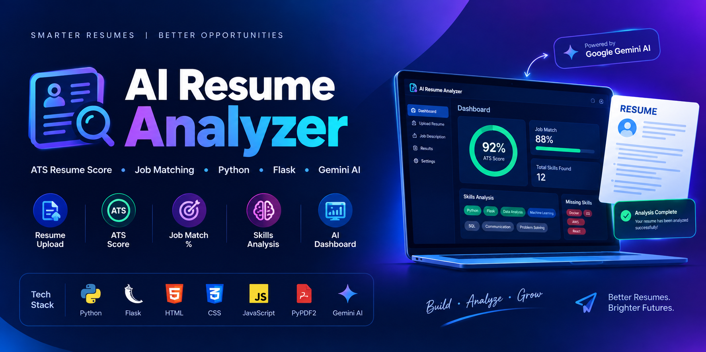

<p align="center">
  
</p>
# 🤖 AI Resume Analyzer

An AI-powered Resume Analyzer built with **Python, Flask, HTML, CSS, and JavaScript** that calculates ATS Resume Score, matches resumes with job descriptions, and provides skill-based recommendations through a professional dashboard.

## 🚀 Features

- ATS Resume Score (0–100)
- Job Description Matching
- Job Match Percentage
- PDF Resume Text Extraction
- Skills Detection
- Missing Skills Identification
- ATS Improvement Suggestions
- Recommended Job Roles
- Colorful Dashboard UI
- Gemini AI Integration
- Local ATS Fallback

## 🛠 Tech Stack

### Frontend
- HTML5
- CSS3
- JavaScript
- Jinja2

### Backend
- Python
- Flask
- PyPDF2
- Google Gemini AI
- python-dotenv

## 📂 Project Structure

```text
AI-Resume-Analyzer/
│── app.py
│── requirements.txt
│── .env
│── .gitignore
│── uploads/
│── templates/
│   └── index.html
└── static/
    └── css/
        └── style.css
